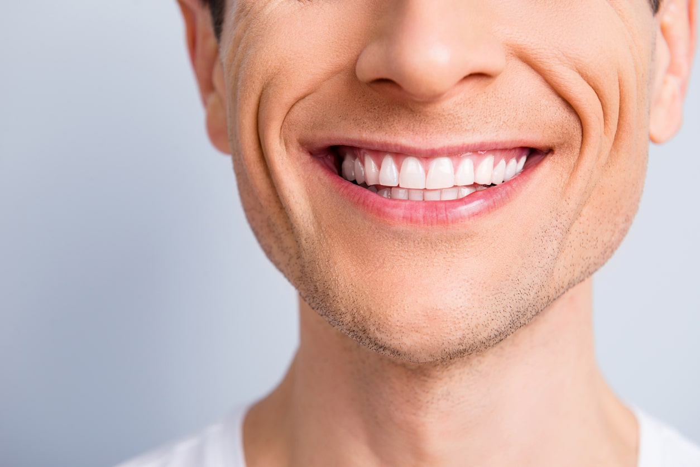
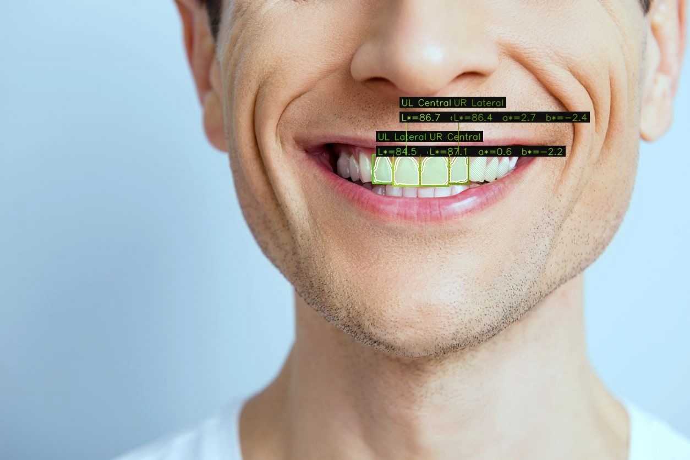

# Dental Color Analyzer

A command‑line tool that finds the four upper incisors in a dental photo, extracts their LAB colour values, and draws an annotated output image.

<div align="center">
  
  
</div>

**Important:** The script works best when MediaPipe can detect a full face. A fallback exists for cropped images (e.g., close‑up dental photos), but it's experimental and may fail. For reliable results, make sure the image shows the full face (at least from forehead to chin).

## What it does

- Locates the mouth region using MediaPipe Face Mesh (primary method)
- Falls back to a colour‑based detector if MediaPipe fails – but this is less reliable
- Segments the teeth using LAB + HSV thresholds
- Separates upper teeth from lower teeth by finding the occlusion line
- Splits the four upper incisors using valley detection and anatomical proportions
- Reports **L*, a*, b*** for each tooth (overexposed pixels are ignored)
- Saves an annotated image with coloured overlays, labels, and divider lines
- Optionally outputs JSON for further analysis

## Requirements

- Python 3.8+
- OpenCV  
- MediaPipe  
- NumPy  
- SciPy  

Install everything with:

```bash
pip install opencv-python mediapipe numpy scipy
```

## Installation

Clone the repository (or copy the `dental_color/` folder) and run the CLI module directly.

## Usage

### Single image

```bash
python -m dental_color.cli my_photo.jpg --output result.jpg
```

This creates `result.jpg` with overlays and prints the LAB values to the console.

### Batch processing

```bash
python -m dental_color.cli /path/to/images --batch --output /path/to/output
```

### Save JSON results

For a single image:

```bash
python -m dental_color.cli photo.jpg --json data.json
```

For batch:

```bash
python -m dental_color.cli images/ --batch --json summary.json
```

### Disable white balance

By default, the script applies a gray‑world white balance to normalise lighting. Turn it off if you need original, unmodified colours:

```bash
python -m dental_color.cli photo.jpg --no-white-balance
```

## Command‑line options

| Argument | Effect |
|----------|--------|
| `input` | Image file or directory (required) |
| `--output` | Output image file (single) or directory (batch) |
| `--no-white-balance` | Skip automatic white balance |
| `--json` | Save detailed results as JSON |
| `--batch` | Process all images in the input directory |

## Output example

Console:

```
Results:
  UL Lateral: L*=78.2, a*=2.1, b*=15.3 (pixels=1245)
  UL Central: L*=82.5, a*=1.5, b*=14.2 (pixels=1380)
  UR Central: L*=83.1, a*=1.3, b*=13.8 (pixels=1402)
  UR Lateral: L*=79.8, a*=1.9, b*=15.0 (pixels=1283)

Average (4 incisors): L*=80.9, a*=1.7, b*=14.6
```

JSON output:

```json
{
  "image_path": "my_photo.jpg",
  "white_balance_applied": true,
  "tooth_lab_values": {
    "UL Lateral": {"L": 78.2, "a": 2.1, "b": 15.3},
    "UL Central": {"L": 82.5, "a": 1.5, "b": 14.2},
    "UR Central": {"L": 83.1, "a": 1.3, "b": 13.8},
    "UR Lateral": {"L": 79.8, "a": 1.9, "b": 15.0}
  },
  "tooth_pixel_counts": {
    "UL Lateral": 1245,
    "UL Central": 1380,
    "UR Central": 1402,
    "UR Lateral": 1283
  },
  "average_lab": {"L": 80.9, "a": 1.7, "b": 14.6}
}
```

## Known limitations

- **Primary requirement:** MediaPipe Face Mesh must detect a face. The fallback (vision‑only) exists but is **experimental** and often fails on tightly cropped images. For best results, use full‑face photos (from chin to eye-level at least).
- Only works for **upper incisors** (the four central teeth).
- Assumes teeth are the brightest, least saturated objects in the mouth.
- May mis‑segment if there are large fillings, dark stains, or very prominent canines.
- Requires the mouth to be open (teeth visible), lips clearly visible.

## How it works (briefly)

1. **Mouth detection** – tries MediaPipe Face Mesh; if that fails, attempts a YCrCb skin detector + row‑score scan (unreliable).
2. **Teeth segmentation** – thresholds in LAB and HSV space (high L, low S, low a, low b).
3. **Upper/lower separation** – finds the horizontal valley in the row‑sum profile (the occlusion line).
4. **Incisor splitting** – analyses the column‑sum profile, detects valleys, and uses anatomical width ratios.
5. **LAB sampling** – converts to LAB, excludes overexposed pixels (L* > 92%).
6. **Visualisation** – draws coloured fills, hatches, contours, bounding boxes, labels, and dashed divider lines.
